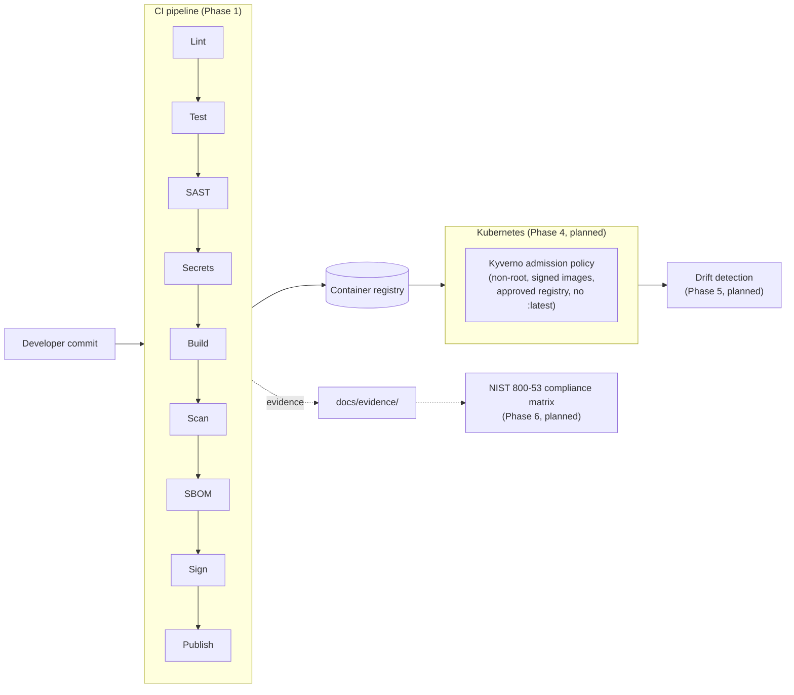

# ato-in-a-pipeline

A DoD-style DevSecOps software factory: a small FastAPI service ("Readiness
Board") whose CI pipeline enforces **hard-blocking** security gates (SAST,
secrets, vulnerability scanning), produces signed images with attached
SBOMs, and (in later phases) deploys through Kyverno-enforced Kubernetes
policy. The pipeline is the product; the app exists to be shipped by it.
Everything runs locally or in free CI tiers — no cloud spend, and this is
not a real ATO (see [`Project.md`](Project.md) for the full spec and
non-goals).

## Status

- [x] **Phase 0** — Readiness Board app (FastAPI, 100% test coverage, non-root/read-only-fs container)
- [x] **Phase 1** — CI with hard-blocking gates (Semgrep, Gitleaks, Trivy, Syft, Cosign)
- [x] **Phase 2** — Hardened base image (UBI9) + OpenSCAP DISA STIG remediation
- [ ] Phase 3 — Terraform/LocalStack infra
- [ ] Phase 4 — Kubernetes deploy with Kyverno policy enforcement
- [ ] Phase 5 — Continuous monitoring (drift detection)
- [ ] Phase 6 — NIST 800-53 compliance matrix

## Architecture



## Quickstart

Available today (Phase 0-2):

```bash
make venv    # create .venv, install dev dependencies
make test    # pytest, 100% coverage gate
make lint    # ruff
make image   # build the hardened UBI9-based container image
make run     # run the app locally against a SQLite DB
```

A full `make demo` (spin up kind/k3s and deploy end-to-end through every
gate) lands in Phase 4, once there's a Kubernetes policy layer for the
image to actually deploy through.

## CI pipeline (Phase 1)

`.gitlab-ci.yml` and `.github/workflows/pipeline.yml` both run the same
nine stages: `lint → test → sast → secrets → build → scan → sbom → sign →
publish`.

- **SAST** — Semgrep (`.semgrep.yml`), fails on ERROR severity.
- **Secrets** — Gitleaks (`.gitleaks.toml`), fails on any finding.
- **Scan** — Trivy, fails on CRITICAL (unfixed CVEs with no vendor patch are
  tracked, not blocking — [ADR 0002](docs/adr/0002-trivy-unfixed-cve-policy.md)).
- **SBOM** — Syft emits SPDX + CycloneDX, retained 30 days.
- **Sign** — Cosign signs the image digest with a repo key pair
  ([ADR 0001](docs/adr/0001-cosign-key-management.md)); `cosign.pub` is
  committed, the private key lives only as a CI secret.

Evidence that the gates actually block, not just advise:
[`docs/evidence/phase1-scan-gate-blocks-vulnerable-dependency.txt`](docs/evidence/phase1-scan-gate-blocks-vulnerable-dependency.txt)
— a deliberately vulnerable dependency (`pyyaml==5.3.1`, CVE-2020-14343,
CRITICAL) fails the scan stage with exit code 1.

## Hardened base image (Phase 2)

Attempted Iron Bank (`registry1.dso.mil`) first; access requires a
Platform One SSO account with no public/anonymous pull path, so the
project falls back to `registry.access.redhat.com/ubi9/ubi-minimal` per
`Project.md`'s own fallback plan. Full writeup, including why the s2i
`python-312` image was rejected (1.6GB vs. 279MB) and the Trivy before/after
numbers: [ADR 0003](docs/adr/0003-base-image.md).

**OpenSCAP DISA STIG remediation summary** (RHEL9 STIG profile, full
reports: [before](docs/evidence/phase2-openscap-stig-before.html) /
[after](docs/evidence/phase2-openscap-stig-after.html)):

| | Before | After |
| --- | --- | --- |
| Pass | 61 | 65 |
| Fail | 7 | 3 |
| Not applicable | 415 | 415 |
| Not checked (manual/procedural) | 1 | 1 |

Four rules were remediated directly in the `Dockerfile` (umask policy in
`/etc/bashrc` and `/etc/profile`, root shell-init file permissions tightened
to 0640, `/etc/tmpfiles.d/rootfiles.conf` override). The remaining three
are documented in [ADR 0003](docs/adr/0003-base-image.md) as structurally
out of scope for a container image — one requires a kernel booted with
`fips=1` (impossible for any container sharing a host kernel), one is an
artifact of the scanner's own install pulling in a PAM stack the shipped
image doesn't otherwise have, and one (DNS servers in `/etc/resolv.conf`)
is overwritten by Docker at container start regardless of what ships in
the image.

## Compliance matrix

Coming in Phase 6 — will map every control implemented above to a NIST
800-53 rev5 control ID with links to the evidence that backs it.
